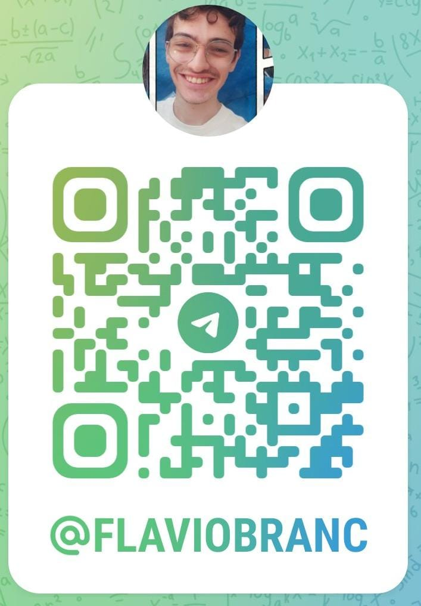

### Flavio Brancalhão (⌐■_■)
## Desenvolvimento front end ❤

  <a href="https://github.com/flaviobrancalhao">

  

  

#### Desenvolvedor(a) web com formação em Análise e Desenvolvimento de Sistemas. Especializado(a) em HTML, CSS, JavaScript e React. Apaixonado(a) por criar interfaces intuitivas e responsivas. Comprometido(a) em entregar soluções de qualidade e acompanhar as tendências tecnológicas. Busco constantemente aprimorar minhas habilidades para desenvolver experiências digitais inovadoras.

## Meus conhecimentos 💻

 

  

  

  

  

  

  

  

  

  

  ##

#### ▶HTML(Hypertext Markup Language):
####  Linguagem de marcação usada para estruturar o conteúdo de páginas da web.
#### ▶ CSS (Cascading Style Sheets):
#### Linguagem de estilo usada para estilizar e formatar páginas da web, fornecendo layout e design visual.
#### ▶ JavaScript:
#### Linguagem de programação de alto nível que permite adicionar interatividade e comportamento dinâmico às páginas da web.
#### ▶ React:
#### Biblioteca JavaScript popular para construção de interfaces de usuário reativas e componentes reutilizáveis.
#### ▶ PHP:
#### Linguagem de script do lado do servidor usada principalmente para desenvolvimento web, permitindo a criação de páginas dinâmicas e interação com bancos de dados.
#### ▶ SQL (Structured Query Language):
#### Linguagem usada para comunicar-se com bancos de dados relacionais, permitindo a criação, manipulação e consulta de dados.
#### ▶ MySQL:
#### Sistema de gerenciamento de banco de dados relacional amplamente utilizado, que permite armazenar, gerenciar e recuperar dados de forma eficiente.

## Formas de contato 📱

 

 

  

   

   

###### Somente telegram

## Descanse um pouco depois de absolver tanta informação 🔥😉

## Continuando 🚶🏻‍♂️

### Sobre mim 

### Sou um amante da tecnologia e programação, e meu coração bate mais forte pelos jogos de vídeo game e pelo incrível universo dos filmes de super-heróis. Além disso, sou um cinéfilo de carteirinha, sempre em busca de emoção nas telonas. Adoro compartilhar minha paixão por jogos, tecnologia, cinema e super-heróis com a galera. Se quiser trocar ideias sobre esses assuntos, estou sempre pronto para uma boa conversa!

## Projetos 📽

### QR Pet

#### QR Pet é um projeto React inovador que tem como objetivo auxiliar na localização de animais de estimação perdidos. Utilizando a tecnologia de códigos QR, o aplicativo permite que os usuários gerem etiquetas personalizadas com QR codes exclusivos para seus pets. Quando alguém encontra um animal perdido, basta escanear o QR code com um smartphone para obter informações vitais sobre o animal e entrar em contato com seu dono. O QR Pet oferece uma interface intuitiva e fácil de usar, permitindo que os usuários registrem informações importantes sobre seus animais, como nome, descrição, contatos de emergência e até mesmo informações médicas relevantes. Com o QR Pet, encontrar e reunir animais de estimação perdidos com seus donos torna-se uma tarefa mais rápida e eficiente, ajudando a trazer segurança e alívio para os amantes de animais.
༼ つ ◕_◕ ༽つ Obrigado por ler 

## links de projetos 

### React
* [BsnagoCine]([https://expo.io/](https://bsnagacine.netlify.app/)

  ## Certificados 📝

