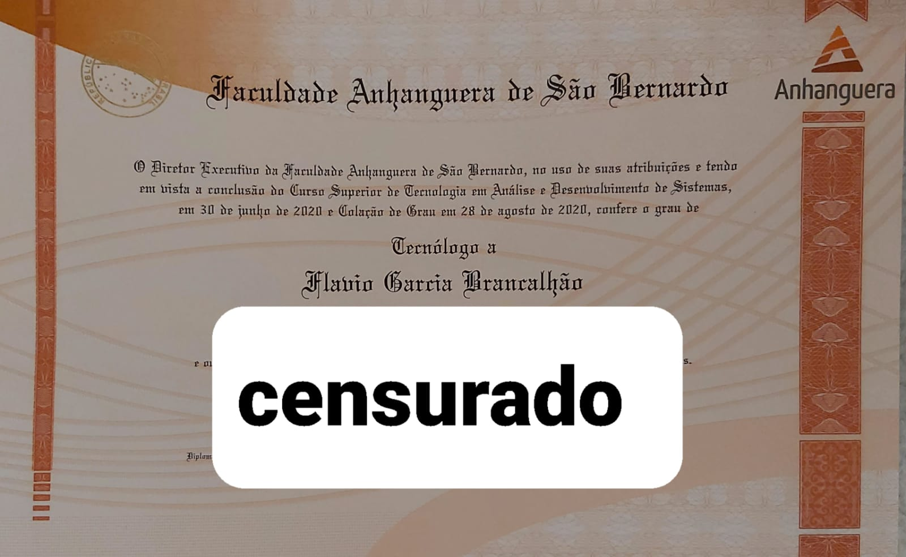
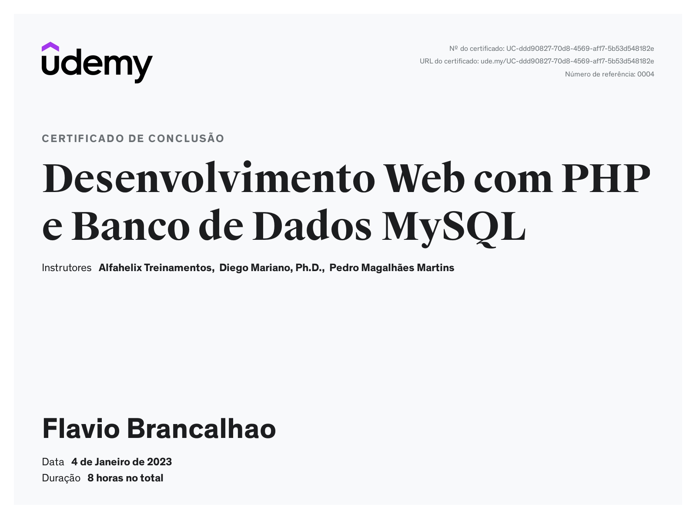
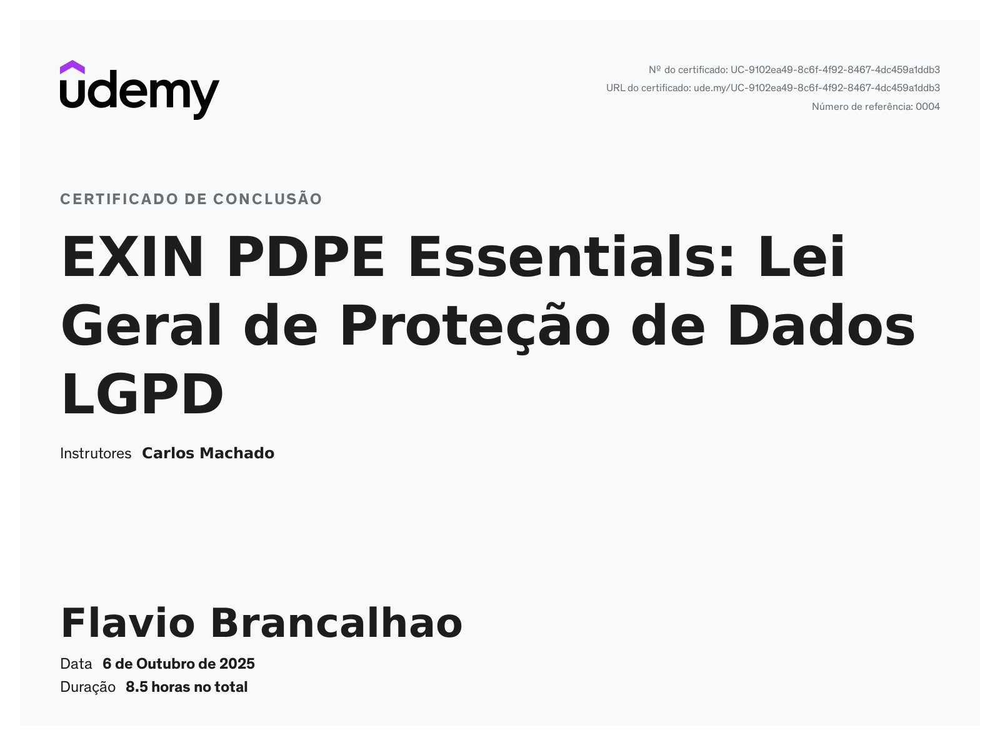
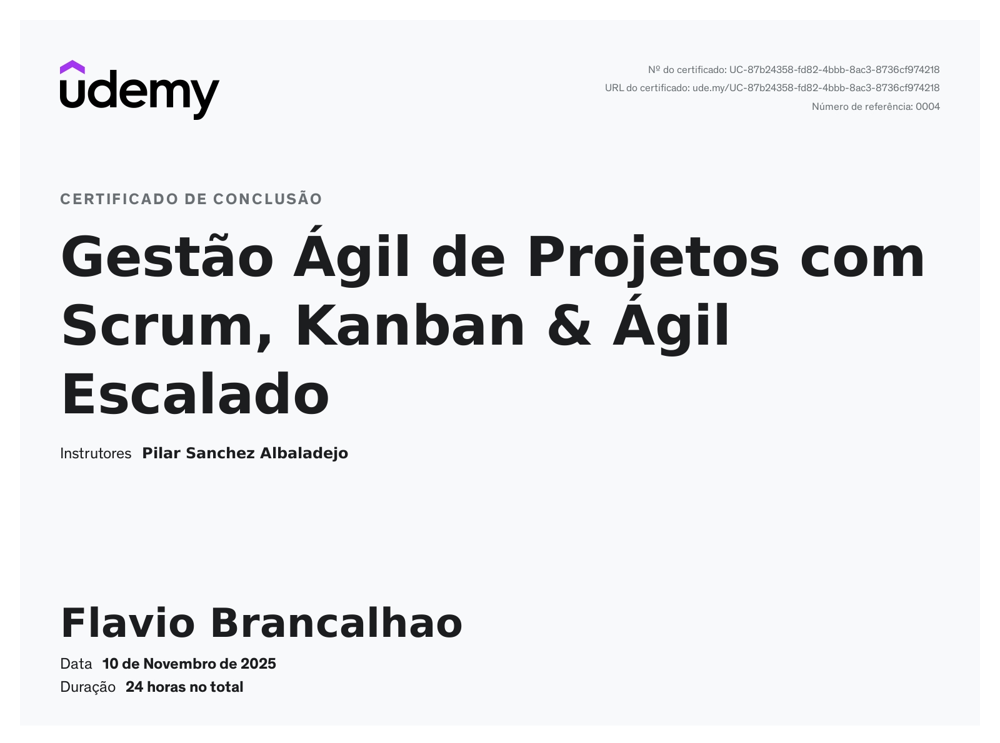
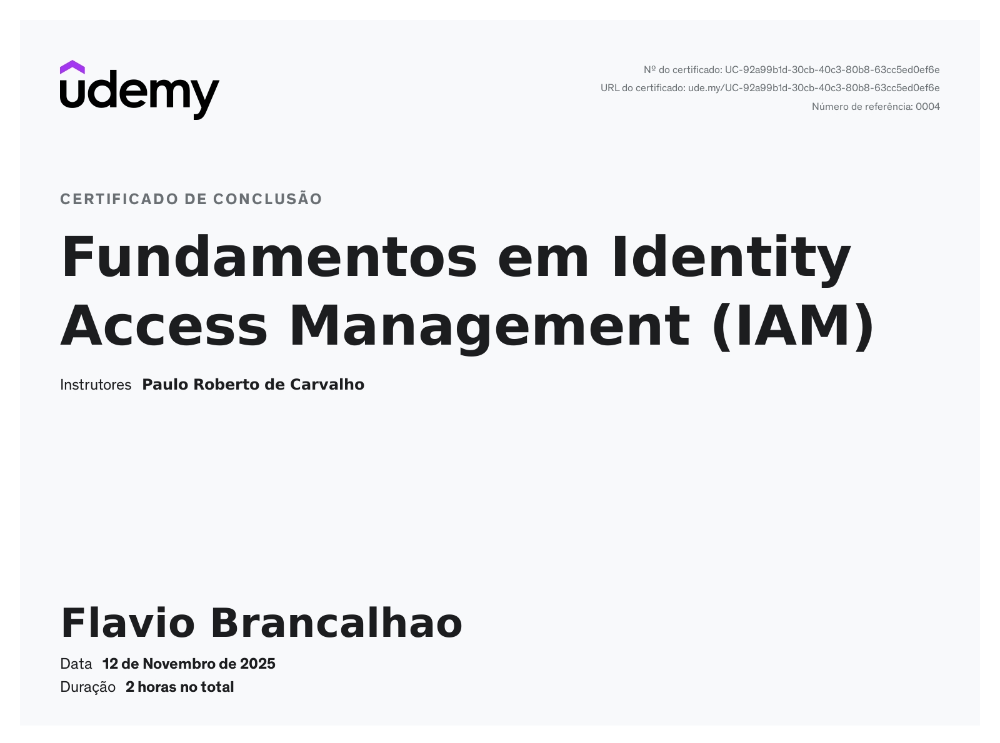
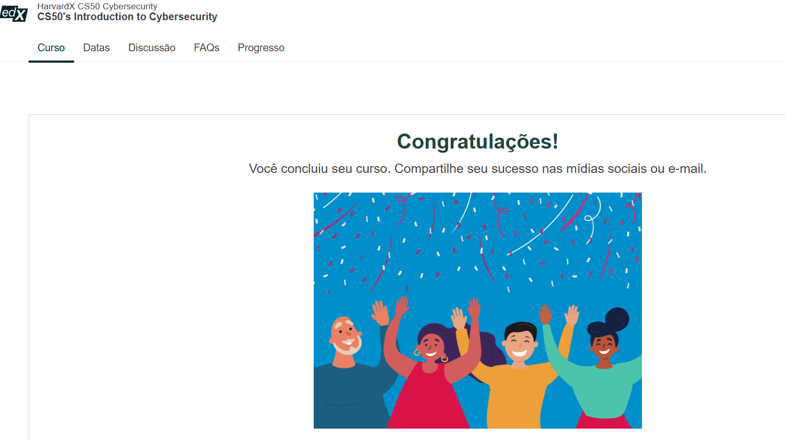

# **Flavio Brancalhão** (⌐■_■)
CyberSegurança

## 🎯 Objetivos

**Primário:** Analista de segurança da informação ❤  
**Secundário:** Analista de Service Desk (Suporte Técnico) 

---
## 👤 Sobre Mim

Sou um amante da tecnologia e programação, e meu coração bate mais forte pelos jogos de vídeo game e pelo incrível universo dos filmes de super-heróis. Além disso, sou um cinéfilo de carteirinha, sempre em busca de emoção nas telonas.

Adoro compartilhar minha paixão por jogos, tecnologia, cinema e super-heróis com a galera. Se quiser trocar ideias sobre esses assuntos, estou sempre pronto para uma boa conversa!

---

## 💻 Meus Conhecimentos

## 📝 Certificados

---

