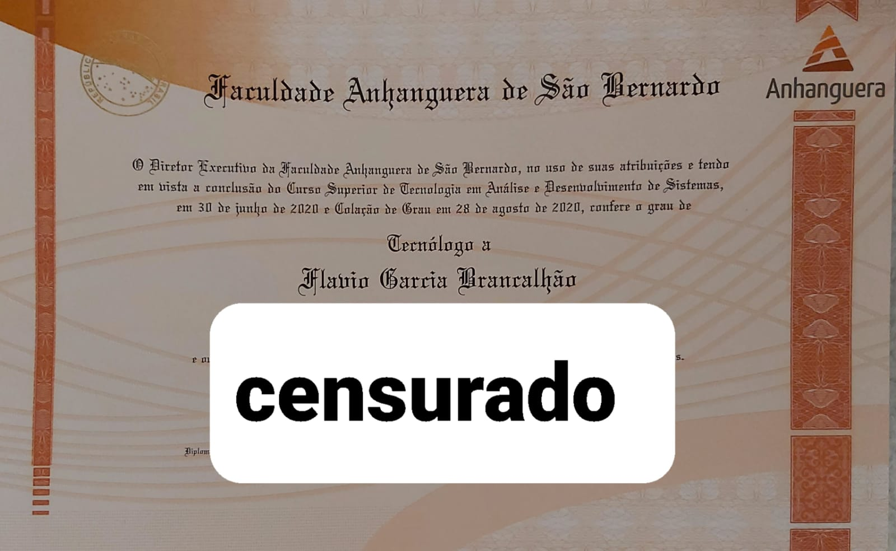
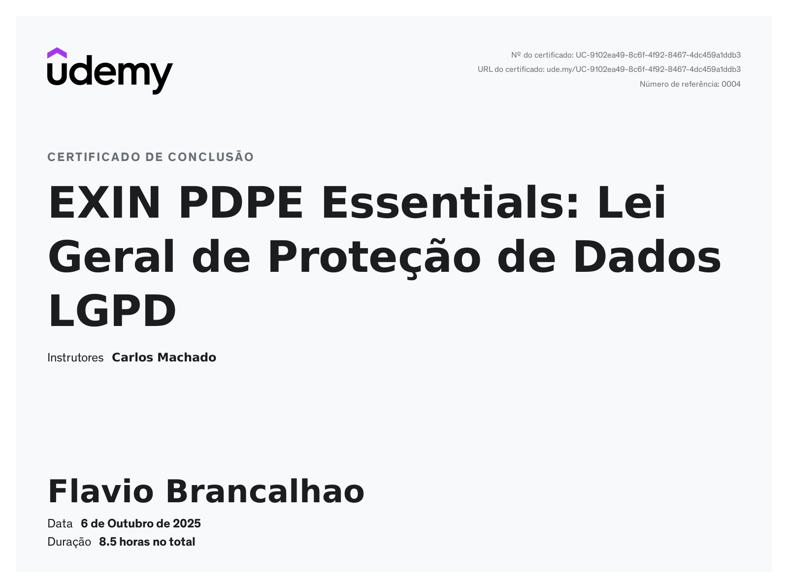

# **Flavio Brancalhão** (⌐■_■)

## 🎯 Objetivos

**Primário:** Desenvolvimento Front-End ❤ 
**Secundário:** Analista de Service Desk (Suporte Técnico)

---

## 📋 Menu

- [Sobre & GitHub](#sobre--github)
- [Linha do Tempo Profissional](#-linha-do-tempo-profissional)
- [Ferramentas & Conhecimentos](#meus-conhecimentos-)
- [Formas de Contato](#formas-de-contato-)
- [Sobre Mim](#sobre-mim)
- [Projetos](#projetos-)
- [Certificados](#certificados-)

---

## Sobre & GitHub

  

## 💻 Meus Conhecimentos

▶ **HTML** &nbsp;&nbsp;&nbsp; ▶ **CSS** &nbsp;&nbsp;&nbsp; ▶ **JavaScript** &nbsp;&nbsp;&nbsp; ▶ **React**  
▶ **PHP** &nbsp;&nbsp;&nbsp; ▶ **SQL** &nbsp;&nbsp;&nbsp; ▶ **MySQL** &nbsp;&nbsp;&nbsp; ▶ **Vite**  
▶ **Tailwind**

---

## 🧑‍💼 Linha do Tempo Profissional

### 🟢 2015 - 2016
- **Menor Aprendiz** — *Sonda Supermercados*  
  Curso Profissionalizante em **Administração de Supermercados**

### 🔴 2016 - 2018
- **Separador de Mercadorias** — *Sonda Supermercados*

### 🟢 2018 - 2020
- **Curso:** Análise e Desenvolvimento de Sistemas — *Anhanguera Educacional*

### 🔴 2020 - 2023
- **Analista de Service Desk** — *TIM (PJ)*

### 🟢 2023 - 2025
- **Analista de Telecom** — *Ativu - Verzani e Sandrini*

---

## 📱 Formas de Contato

  
[LinkedIn](https://www.linkedin.com/in/flaviobrancalhao)  
[WhatsApp](https://wa.me/5511987704919)

---

## 👤 Sobre Mim

Sou um amante da tecnologia e programação, e meu coração bate mais forte pelos jogos de vídeo game e pelo incrível universo dos filmes de super-heróis. Além disso, sou um cinéfilo de carteirinha, sempre em busca de emoção nas telonas.

Adoro compartilhar minha paixão por jogos, tecnologia, cinema e super-heróis com a galera. Se quiser trocar ideias sobre esses assuntos, estou sempre pronto para uma boa conversa!

---

## 📽 Projetos

- [🎬 BsnagoCine](https://bsnagacine.netlify.app/)
- [🐾 QrPet](https://qrpet.vercel.app/)
- [🎾 Placar de Tênis](https://placartenis.netlify.app/)
- [🧵 Ateliê Garcia](https://ateliegarcia.netlify.app)
- [🎨 Thai Tattoo Studio (freelancer)](https://thaitattoostudio.com.br/)
- [🪟 CH Vidros (freelancer)](https://chvidros.vercel.app/)

---

## 📝 Certificados

---

**༼ つ ◕_◕ ༽つ Obrigado por ler!**

